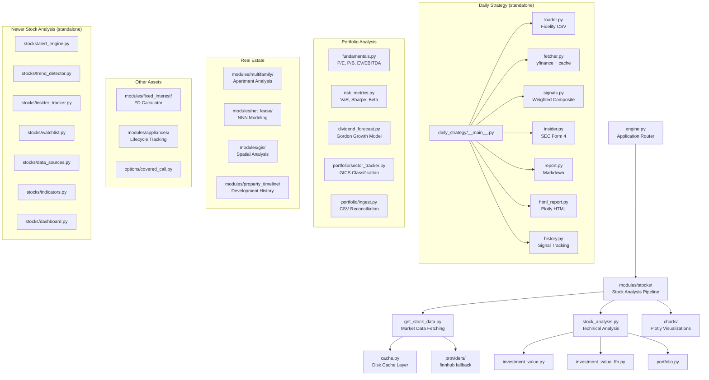

# Architecture Overview

## Module Dependency Map



## Data Flow

```
Fidelity CSV Export ─→ loader.py ─→ positions dict
                                         │
yfinance API ──→ fetcher.py ──→ OHLCV + fundamentals
                                         │
SEC EDGAR ────→ insider.py ──→ Form 4 filings
                                         │
                              signals.py (weighted composite)
                                         │
                              ┌───────────┴───────────┐
                          report.py              html_report.py
                          (Markdown)             (Plotly HTML)
                              │                       │
                   reports/daily-strategy/   reports/daily-strategy/
                   YYYY-MM-DD.md            YYYY-MM-DD.html
```

## Configuration Hierarchy

```
config/daily_strategy.yaml     ← Portfolio targets, ticker modes, thresholds
    └── CLI args               ← Override config path, enable --no-write, --compare
        └── Module defaults    ← RSI thresholds, SMA periods, cache TTLs
```

## Cache Strategy

| Data Type | TTL | Storage |
|-----------|-----|---------|
| OHLCV price data | 4 hours | Local disk (diskcache) |
| Fundamentals (P/E, P/B) | 24 hours | Local disk (diskcache) |
| Insider filings | 24 hours | Local disk (diskcache) |
| Sector classifications | Static | In-memory dict |

## Module Status

| Module | LOC | Status | Tests |
|--------|-----|--------|-------|
| analysis/daily_strategy/ | ~2,500 | Production | 7 unit test files |
| risk_metrics.py | 358 | Complete | Yes |
| fundamentals.py | 358 | Complete | Yes |
| dividend_forecast.py | 179 | Complete | Yes |
| portfolio/sector_tracker.py | ~400 | Complete | Yes |
| portfolio/ingest.py | ~200 | Complete | Yes |
| stocks/ (newer) | ~550 | Complete | 8 unit test files |
| modules/stocks/ (engine) | ~1,200 | Working (needs consolidation with stocks/) | Partial |
| modules/appliances/ | 965 | Partial | No |
| modules/gis/ | ~800 | Partial (imagery deferred) | 5 tests |
| modules/multifamily/ | 901 | Working | No |
| modules/net_lease/ | 316 | Working | No |
| modules/fixed_interest/ | 165 | Complete | Yes |
| options/covered_call.py | 364 | Partial | No |

## External Dependencies

| Category | Package | Purpose |
|----------|---------|---------|
| Financial data | yfinance | Price, fundamentals, insider filings |
| Financial data | yahoo_fin | Supplementary stock info |
| Financial data | sec_edgar_downloader | SEC EDGAR filings |
| Technical analysis | ta | RSI, SMA, Bollinger, MACD |
| Financial math | ffn | Returns, drawdown, benchmarking |
| Financial math | numpy_financial | IRR, NPV, PMT |
| Visualization | plotly | Interactive HTML charts |
| Visualization | dash | Dashboard framework |
| Data | pandas | DataFrames |
| Data | sqlalchemy | Database ORM |
| Config | pyyaml, ruamel.yaml | YAML configuration |
| Templating | jinja2 | Report templates |
| Geospatial | shapely, geopandas | GIS analysis (optional) |
